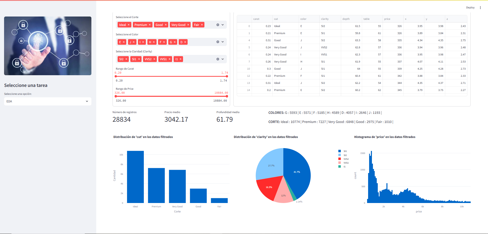
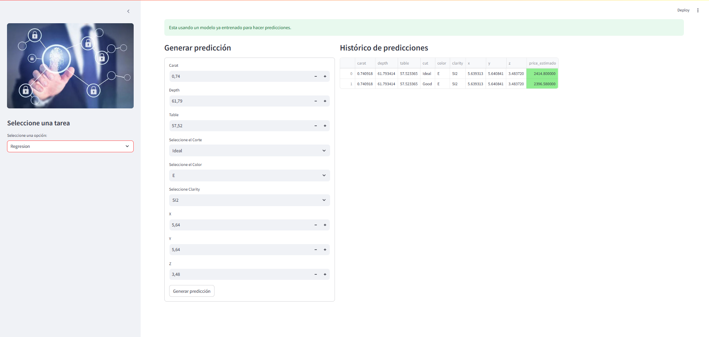
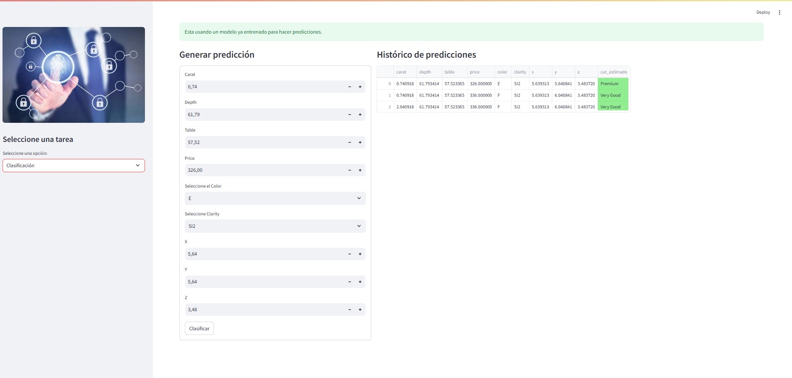

# M7 Streamlit - Hack Boss

Este repositorio forma parte del ejercicio 7 y contiene una aplicación web interactiva desarrollada con [Streamlit](https://streamlit.io/). La aplicación ha sido diseñada para demostrar el uso de técnicas modernas en el desarrollo de interfaces interactivas con Python.

## Aplicación.

-**Trabajo EDA**.

-**Regresión**.

-**Clasificación**.


## Descripción

La aplicación implementada en este módulo se encuadra en el contexto de la asignatura o desafío hackathon "Streamlit". Su propósito principal es mostrar la integración de datos y visualizaciones en tiempo real, ofreciendo una interfaz sencilla y elegante mediante Streamlit. Entre las funcionalidades destacadas se incluyen:
- Visualización interactiva de datos.
- Integración de componentes de Python para análisis de información.
- Implementación de un flujo de trabajo que permite la expansión y personalización de la aplicación.

## Características

- **Interactividad:** Utiliza las capacidades de Streamlit para ofrecer una experiencia de usuario interactiva sin necesidad de desarrollar una infraestructura web compleja.
- **Modularidad:** El código está organizado de forma modular, facilitando la incorporación de nuevas funcionalidades o la adaptación a otros proyectos.
- **Facilidad de uso:** Permite desplegar la aplicación de forma sencilla tanto en entornos locales como en servicios de despliegue en la nube.
- **Documentación:** Este README proporciona información esencial para la instalación, configuración y uso de la aplicación.


## Instalación y Configuración

1. **Clonar el repositorio**

   Desde la terminal, clona el repositorio utilizando Git:
   ```bash
   git clone https://github.com/loritobad/hack_boss_ejer.git

2. **Instalar requeriments.**
    Ejecute requeriments.txt con:
    ```bash
    pip install -r requeriments.txt
